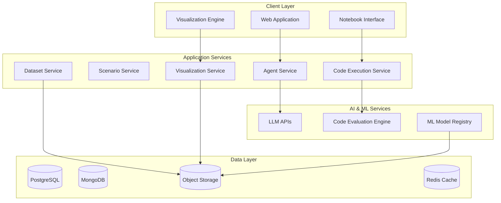

# DataMentor AI: Multi-Agent Data + AI Education Platform
## Product Planning Document

---

## 1. Product Vision & Scope

### Vision Statement
"Democratize Data + AI education by providing realistic, interactive simulations that prepare learners for real-world challenges in data analysis, engineering, and data science roles."

### Mission
Create an AI-powered platform where aspiring data professionals can practice critical skills in simulated workplace environments, receiving personalized mentorship and feedback from industry-expert AI agents.

### Product Name: **DataMentor AI**

### Target Market Scope
- **Primary**: Career changers entering data/AI field (bootcamp graduates, self-learners)
- **Secondary**: University students in data science programs
- **Tertiary**: Working professionals upskilling in data/AI

### Core Value Propositions
1. **Real-world Practice**: Simulate actual workplace scenarios and challenges
2. **Personalized Learning**: Adapt to individual skill levels and learning styles
3. **Industry-Relevant Skills**: Focus on practical skills demanded by employers
4. **Safe Learning Environment**: Make mistakes without real-world consequences
5. **Continuous Assessment**: Track progress and identify skill gaps

---

## 2. Key Learning Scenarios & Use Cases

### 2.1 Data Analyst Role Scenarios

#### **Scenario 1: Stakeholder Requirements Gathering**
**Learning Objective**: Master the art of translating business questions into analytical requirements

**Simulation Setup**:
- **Student Role**: Junior Data Analyst
- **AI Agents**: 
  - Business Stakeholder Agent (Marketing Manager persona)
  - Senior Analyst Mentor Agent
  - Technical Reviewer Agent

**Practice Activities**:
- Conduct stakeholder interviews to understand business problems
- Ask clarifying questions to define scope and success metrics
- Present analysis approach and get buy-in
- Handle ambiguous or changing requirements

**Assessment Criteria**:
- Quality of questions asked
- Ability to identify key metrics and KPIs
- Communication clarity and professionalism
- Problem scoping accuracy

#### **Scenario 2: Data Quality Assessment & Cleaning**
**Learning Objective**: Identify data quality issues and propose solutions

**Simulation Setup**:
- Real-world messy datasets (customer data, sales data, web analytics)
- Database Administrator Agent (provides context on data sources)
- Quality Assurance Agent (reviews cleaning approach)

**Practice Activities**:
- Explore and profile unfamiliar datasets
- Identify missing values, outliers, inconsistencies
- Propose and implement cleaning strategies
- Document data quality issues and solutions

#### **Scenario 3: Executive Dashboard Presentation**
**Learning Objective**: Present analytical findings to non-technical executives

**Simulation Setup**:
- C-Suite Executive Agents (CEO, CMO, CFO personas)
- Presentation Coach Agent
- Data visualization challenge with complex findings

**Practice Activities**:
- Create executive-level visualizations
- Present key insights in 5-minute format
- Handle executive questions and pushback
- Adapt presentation based on audience reactions

### 2.2 Data Engineer Role Scenarios

#### **Scenario 1: Data Pipeline Design Review**
**Learning Objective**: Design scalable, maintainable data pipelines

**Simulation Setup**:
- Senior Data Engineer Agent (technical mentor)
- DevOps Engineer Agent (infrastructure concerns)
- Data Scientist Agent (downstream user)

**Practice Activities**:
- Design ETL/ELT pipeline for streaming data
- Present architecture to technical team
- Address scalability and reliability concerns
- Handle trade-off discussions (cost vs. performance)

#### **Scenario 2: Production Data Crisis Management**
**Learning Objective**: Troubleshoot and resolve data pipeline failures under pressure

**Simulation Setup**:
- Incident Commander Agent (manages crisis response)
- Anxious Stakeholder Agents (business users affected)
- SRE Agent (system reliability perspective)

**Practice Activities**:
- Diagnose pipeline failures from monitoring alerts
- Communicate status updates to stakeholders
- Implement quick fixes vs. long-term solutions
- Conduct post-mortem analysis

#### **Scenario 3: Data Governance Implementation**
**Learning Objective**: Implement data governance policies and procedures

**Simulation Setup**:
- Chief Data Officer Agent
- Compliance Officer Agent
- Business Unit Representatives

**Practice Activities**:
- Define data lineage and catalog requirements
- Implement data access controls and permissions
- Create data quality monitoring frameworks
- Balance governance needs with user productivity

### 2.3 Data Scientist Role Scenarios

#### **Scenario 1: Machine Learning Model Development**
**Learning Objective**: Full ML lifecycle from problem definition to deployment

**Simulation Setup**:
- Product Manager Agent (defines business problem)
- ML Engineering Agent (deployment concerns)
- Model Validation Agent (bias and fairness review)

**Practice Activities**:
- Translate business problem to ML problem
- Design experiments and select appropriate algorithms
- Handle model performance discussions
- Address bias, fairness, and interpretability concerns

#### **Scenario 2: A/B Test Design and Analysis**
**Learning Objective**: Design statistically rigorous experiments

**Simulation Setup**:
- Product Manager Agent (wants quick results)
- Statistical Reviewer Agent (rigorous methodology)
- Engineering Agent (implementation constraints)

**Practice Activities**:
- Design experiment with proper power analysis
- Handle requests to "peek" at results early
- Interpret results and recommend actions
- Deal with confounding factors and external events

#### **Scenario 3: Model Performance Deterioration Investigation**
**Learning Objective**: Monitor, detect, and address model drift

**Simulation Setup**:
- Operations Manager Agent (business impact focus)
- ML Platform Agent (technical infrastructure)
- Domain Expert Agent (business context)

**Practice Activities**:
- Investigate declining model performance
- Identify root causes (data drift, concept drift, etc.)
- Propose and implement solutions
- Set up monitoring and alerting systems

### 2.4 Cross-Functional Scenarios

#### **Scenario 1: Data Strategy Planning Session**
**Learning Objective**: Collaborate across functions to develop data strategy

**Multi-Role Simulation**:
- Students can play different roles (analyst, engineer, scientist)
- Executive Stakeholder Agents
- Cross-functional team dynamics

#### **Scenario 2: Technical Interview Practice**
**Learning Objective**: Prepare for data role job interviews

**Interview Simulation**:
- Technical Interviewer Agents (different company styles)
- Behavioral Interview Agent
- Technical Assessment Challenges

---

## 3. AI Agent Personas for Data/AI Industry

### 3.1 Mentor/Coach Agents

#### **Senior Data Analyst Mentor**
```yaml
Persona:
  Name: "Sarah Chen"
  Background: "10+ years in data analytics, worked at both startups and Fortune 500"
  Personality: "Patient, detail-oriented, business-focused"
  Teaching Style: "Socratic method, asks probing questions"
  Expertise: "SQL, Python, Tableau, stakeholder management"
  Common Phrases: 
    - "What story is the data telling us?"
    - "How would you explain this to a non-technical stakeholder?"
    - "Let's think about the business impact here"
```

#### **Principal Data Engineer Mentor**
```yaml
Persona:
  Name: "Marcus Rodriguez"
  Background: "15+ years building data infrastructure at scale"
  Personality: "Pragmatic, systems-thinking, performance-focused"
  Teaching Style: "Hands-on, focuses on best practices and trade-offs"
  Expertise: "Apache Spark, Kafka, Airflow, AWS/GCP, Data Modeling"
  Common Phrases:
    - "How will this scale to 100x the data?"
    - "What's our backup plan if this fails?"
    - "Let's think about the total cost of ownership"
```

#### **Senior Data Scientist Mentor**
```yaml
Persona:
  Name: "Dr. Priya Patel"
  Background: "PhD in Statistics, 8+ years in industry ML"
  Personality: "Methodical, curious, hypothesis-driven"
  Teaching Style: "Scientific method, emphasizes experimentation"
  Expertise: "Machine Learning, Statistics, Python, R, Model Deployment"
  Common Phrases:
    - "What's our null hypothesis here?"
    - "How can we validate this assumption?"
    - "What are the ethical implications of this model?"
```

### 3.2 Stakeholder/Client Agents

#### **Business Executive (CEO/CMO/CFO)**
```yaml
Personas:
  CEO_Agent:
    Focus: "Strategic impact, competitive advantage"
    Questions: "How does this move the needle on revenue?"
    Time Pressure: "High - wants quick, actionable insights"
    
  CMO_Agent:
    Focus: "Customer insights, campaign effectiveness"
    Questions: "What does this tell us about our customers?"
    Concerns: "Attribution, ROI measurement"
    
  CFO_Agent:
    Focus: "Cost optimization, financial impact"
    Questions: "What's the ROI? How much will this cost?"
    Concerns: "Budget constraints, compliance"
```

#### **Product Manager**
```yaml
Persona:
  Name: "Alex Kim"
  Background: "5+ years in product, data-driven decision maker"
  Personality: "Fast-paced, outcome-focused, slightly impatient"
  Concerns: "User experience, feature impact, time-to-market"
  Common Requests:
    - "Can we launch this A/B test tomorrow?"
    - "I need insights on user behavior ASAP"
    - "How do we know if this feature is working?"
```

#### **Engineering Manager**
```yaml
Persona:
  Name: "David Thompson"
  Background: "Software engineer turned manager"
  Personality: "Risk-averse, quality-focused, resource-conscious"
  Concerns: "System reliability, technical debt, team bandwidth"
  Common Pushback:
    - "This will impact system performance"
    - "We need proper testing before deployment"
    - "How will we maintain this long-term?"
```

### 3.3 Technical Review Agents

#### **ML Engineering Reviewer**
```yaml
Persona:
  Name: "Jennifer Wu"
  Background: "ML Infrastructure specialist"
  Focus: "Model deployment, monitoring, scalability"
  Review Criteria:
    - "Can this model handle production load?"
    - "How will we monitor for drift?"
    - "What's the rollback plan?"
```

#### **Data Quality Reviewer**
```yaml
Persona:
  Name: "Robert Singh"
  Background: "Data governance and quality specialist"
  Focus: "Data lineage, quality metrics, compliance"
  Review Criteria:
    - "How do we track data lineage?"
    - "What quality checks are in place?"
    - "Are we compliant with privacy regulations?"
```

---

## 4. Product Requirements Document (PRD)

### 4.1 Core Features (MVP)

#### **Feature 1: Interactive Scenario Engine**
**User Story**: As a data professional learner, I want to practice real-world scenarios so I can build confidence and skills.

**Requirements**:
- Support for multi-turn conversations with AI agents
- Context-aware responses based on previous interactions
- Scenario branching based on user choices
- Progress tracking within scenarios

**Acceptance Criteria**:
- Users can engage in 15-20 minute realistic simulations
- AI agents maintain character consistency throughout
- System tracks user decisions and learning progress
- Scenarios adapt to user skill level

#### **Feature 2: Personalized AI Mentorship**
**User Story**: As a learner, I want personalized guidance that adapts to my experience level and learning goals.

**Requirements**:
- Initial skill assessment and goal setting
- Adaptive coaching based on performance
- Personalized learning path recommendations
- Connection to learner's background/interests

**Acceptance Criteria**:
- System adapts difficulty based on user responses
- Mentorship style adjusts to learning preferences
- Personalized examples relevant to user's background
- Clear guidance on next steps and improvement areas

#### **Feature 3: Comprehensive Progress Analytics**
**User Story**: As a learner, I want to track my progress and identify areas for improvement.

**Requirements**:
- Skill competency mapping and tracking
- Detailed feedback after each scenario
- Progress visualization and goal tracking
- Comparison with industry benchmarks

**Acceptance Criteria**:
- Users receive detailed feedback within 2 minutes of completion
- Progress dashboards show skill development over time
- Actionable recommendations for improvement
- Integration with external learning resources

#### **Feature 4: Instructor/Manager Dashboard**
**User Story**: As an instructor/manager, I want to monitor learner progress and identify common skill gaps.

**Requirements**:
- Individual learner progress tracking
- Cohort/team analytics and insights
- Common struggle identification
- Curriculum recommendations

**Acceptance Criteria**:
- Real-time progress monitoring for managed learners
- Aggregate analytics for cohort performance
- Automated alerts for struggling learners
- Exportable reports and insights

### 4.2 Advanced Features (Future Releases)

#### **Feature 5: Collaborative Team Scenarios**
**User Story**: As a learner, I want to practice working in cross-functional teams.

**Requirements**:
- Multi-user scenario participation
- Role-based permissions and views
- Real-time collaboration tools
- Team performance analytics

#### **Feature 6: Custom Scenario Builder**
**User Story**: As an instructor/organization, I want to create custom scenarios relevant to my specific context.

**Requirements**:
- Drag-and-drop scenario builder
- Custom agent persona creation
- Integration with organization's data/tools
- Scenario sharing and marketplace

#### **Feature 7: Industry Certification Integration**
**User Story**: As a learner, I want my progress to count toward industry certifications.

**Requirements**:
- Alignment with certification requirements
- Verified skill assessments
- Digital badges and certificates
- Integration with professional platforms (LinkedIn)

### 4.3 Technical Requirements

#### **Performance Requirements**:
- Response time: <3 seconds for 95% of AI interactions
- Uptime: 99.5% availability during business hours
- Scalability: Support 500 concurrent users per server instance
- Data security: SOC 2 compliance for educational data

#### **Integration Requirements**:
- LMS integration (Canvas, Blackboard, Moodle)
- SSO integration (Google, Microsoft, SAML)
- Video conferencing integration (Zoom, Teams)
- Analytics platforms (Google Analytics, Mixpanel)

#### **Platform Requirements**:
- Web-based responsive interface
- Mobile-friendly design
- Cross-browser compatibility (Chrome, Firefox, Safari, Edge)
- API-first architecture for third-party integrations

---

## 5. MVP Features & User Stories

### 5.1 MVP Scope Definition

**Core MVP Goal**: Enable data professionals to practice stakeholder communication and technical decision-making in realistic scenarios.

**MVP Constraints**:
- Single role focus: Data Analyst
- 3 core scenarios: Requirements gathering, Data quality assessment, Executive presentation
- Web-only platform
- Individual learning (no collaborative features)
- Basic progress tracking

### 5.2 User Story Mapping

#### **Epic 1: User Onboarding & Profile Setup**
```
As a new user, I want to quickly set up my profile and understand the platform
so I can start learning effectively.

User Stories:
- US-001: Account creation and email verification
- US-002: Skill assessment questionnaire
- US-003: Learning goal setting
- US-004: Platform walkthrough and tutorial
- US-005: AI interaction guidelines and tips
```

#### **Epic 2: Core Learning Experience**
```
As a learner, I want to engage in realistic data analyst scenarios
so I can build practical skills.

User Stories:
- US-006: Select and start a learning scenario
- US-007: Engage in multi-turn conversation with AI agents
- US-008: Receive real-time hints and guidance
- US-009: Make decisions that affect scenario outcomes
- US-010: Complete scenario with performance assessment
```

#### **Epic 3: Progress Tracking & Feedback**
```
As a learner, I want to understand my progress and get actionable feedback
so I can improve my skills effectively.

User Stories:
- US-011: View detailed scenario feedback and scoring
- US-012: Track skill development over time
- US-013: Receive personalized learning recommendations
- US-014: Access learning resources and next steps
- US-015: Compare progress with anonymized benchmarks
```

#### **Epic 4: Content Management**
```
As a platform admin, I want to manage educational content and system settings
so learners have high-quality experiences.

User Stories:
- US-016: Manage AI agent personas and behaviors
- US-017: Configure scenario parameters and difficulty
- US-018: Monitor system performance and AI quality
- US-019: Analyze user engagement and learning outcomes
- US-020: Export analytics and usage reports
```

### 5.3 MVP Success Criteria

**User Engagement Metrics**:
- 70% of new users complete at least one full scenario
- 80% session completion rate for started scenarios
- Average session duration of 15-25 minutes
- 60% of users return within 7 days

**Learning Effectiveness Metrics**:
- 85% of users report improved confidence in measured skills
- 90% user satisfaction score for AI agent quality
- 75% of users would recommend to a colleague
- 25% improvement in post-scenario assessments vs. pre-scenario

**Technical Performance Metrics**:
- 99% uptime during testing period
- <3 second average response time for AI interactions
- <5% error rate in AI conversations
- Zero critical security vulnerabilities

---

## 6. Technical Architecture for Data/AI Context

### 6.1 Specialized Technical Considerations

#### **Data & AI-Specific Requirements**:
- **Code Execution Environment**: Sandbox for Python/SQL code testing
- **Dataset Management**: Storage and access to practice datasets
- **Visualization Rendering**: Support for charts, dashboards, and notebooks
- **Model Artifact Storage**: Storage for ML models and experiments
- **Version Control Integration**: Git integration for code-based scenarios

#### **Enhanced Architecture Components**:



### 6.2 Code Execution Architecture

#### **Secure Code Execution Service**:
```typescript
interface CodeExecutionService {
  executeCode(
    code: string, 
    language: 'python' | 'sql' | 'r',
    context: ExecutionContext
  ): Promise<ExecutionResult>;
  
  validateCode(code: string, constraints: SecurityConstraints): boolean;
  
  getDatasetAccess(datasetId: string, userId: string): Promise<DatasetAccess>;
}

interface ExecutionContext {
  timeLimit: number;
  memoryLimit: number;
  allowedLibraries: string[];
  datasetAccess: string[];
  userId: string;
}
```

#### **Dataset Management Service**:
```typescript
interface DatasetService {
  getDataset(id: string): Promise<Dataset>;
  createSyntheticDataset(spec: DatasetSpec): Promise<Dataset>;
  validateDataAccess(userId: string, datasetId: string): boolean;
}

interface Dataset {
  id: string;
  name: string;
  description: string;
  schema: DataSchema;
  sampleData: any[];
  accessUrl: string;
  metadata: DatasetMetadata;
}
```

### 6.3 AI Agent Enhancements for Data/AI Context

#### **Technical Knowledge Integration**:
```typescript
interface DataAIAgent extends Agent {
  // Enhanced with domain knowledge
  evaluateCode(code: string): Promise<CodeEvaluation>;
  suggestBestPractices(context: TechnicalContext): Promise<Suggestion[]>;
  explainConcepts(concept: string, level: SkillLevel): Promise<Explanation>;
}

interface CodeEvaluation {
  correctness: number;
  efficiency: number;
  bestPractices: BestPracticeCheck[];
  suggestions: string[];
  alternativeApproaches: string[];
}
```

#### **Domain-Specific Prompt Engineering**:
```yaml
DataAnalystMentor:
  SystemPrompt: |
    You are Sarah Chen, a Senior Data Analyst with 10+ years of experience.
    You specialize in SQL, Python pandas, and business intelligence.
    
    Key behaviors:
    - Always ask about business context before diving into technical solutions
    - Emphasize data quality and validation
    - Focus on actionable insights and storytelling
    - Use real-world examples from retail, finance, or SaaS
    
    When reviewing code:
    - Check for proper null handling
    - Ensure efficient query patterns
    - Validate statistical assumptions
    - Suggest visualization improvements
    
    Communication style:
    - Patient and encouraging
    - Uses analogies to explain complex concepts
    - Asks probing questions to guide learning
```

---

## 7. Go-to-Market Strategy & Business Model

### 7.1 Target Market Analysis

#### **Primary Market Segments**:

**1. Career Changers (40% of market)**
- Demographics: 25-35 years old, college-educated, currently in non-data roles
- Pain Points: Lack of practical experience, portfolio gaps, interview anxiety
- Willingness to Pay: $50-200/month for comprehensive learning
- Sales Channel: Direct-to-consumer, online marketing

**2. Bootcamp/Program Graduates (25% of market)**
- Demographics: Recent bootcamp or certificate program completers
- Pain Points: Theory-practice gap, job interview preparation
- Willingness to Pay: $30-100/month, often employer-sponsored
- Sales Channel: B2B partnerships with education providers

**3. University Students (20% of market)**
- Demographics: Computer science, statistics, business analytics students
- Pain Points: Limited real-world experience, career preparation
- Willingness to Pay: $20-50/month (price-sensitive)
- Sales Channel: University partnerships, student discounts

**4. Working Professionals (15% of market)**
- Demographics: Analysts, engineers wanting to upskill in AI/ML
- Pain Points: Time constraints, staying current with technology
- Willingness to Pay: $100-300/month (or employer-sponsored)
- Sales Channel: B2B enterprise sales, professional development budgets

### 7.2 Business Model

#### **Revenue Streams**:

**1. Subscription Tiers (Primary - 70% of revenue)**
```yaml
Basic Plan ($29/month):
  - Access to 3 core scenarios
  - Basic progress tracking
  - Community forum access
  - Limited AI interaction time

Professional Plan ($79/month):
  - All scenarios and role types
  - Unlimited AI interactions
  - Advanced analytics and insights
  - Priority support
  - Custom learning paths

Enterprise Plan ($199/user/month):
  - Everything in Professional
  - Team management and analytics
  - Custom scenario creation
  - SSO and LMS integration
  - Dedicated customer success manager
```

**2. B2B Education Partnerships (20% of revenue)**
- Licensing to bootcamps, universities, and training companies
- White-label platform for education providers
- Custom content development services

**3. Corporate Training (10% of revenue)**
- Enterprise sales to companies for employee development
- Custom scenarios based on company's specific data challenges
- Team-based learning and competition features

### 7.3 Go-to-Market Timeline

#### **Phase 1: Product-Market Fit (Months 1-6)**
**Objective**: Validate core value proposition with early adopters

**Strategy**:
- Launch invite-only beta with 100 carefully selected users
- Focus on career changers and bootcamp graduates
- Intensive user interviews and feedback collection
- Iterate based on user behavior and feedback
- Build waiting list for public launch

**Key Activities**:
- Content marketing (blog, LinkedIn, Twitter)
- Community building in data science forums
- Partnerships with 3-5 coding bootcamps
- User-generated content and testimonials

**Success Metrics**:
- 70% monthly retention rate
- 4.5+ star user satisfaction rating
- 50+ organic referrals
- 20+ case studies/testimonials

#### **Phase 2: Scale & Growth (Months 7-12)**
**Objective**: Scale to 1,000+ paying customers

**Strategy**:
- Public launch with freemium model
- Paid advertising campaigns (Google, LinkedIn, Facebook)
- Influencer partnerships with data professionals
- Conference sponsorships and speaking engagements
- SEO content marketing strategy

**Key Activities**:
- Performance marketing campaigns
- Partnership with major job boards (Indeed, LinkedIn)
- Guest content on popular data science blogs/podcasts
- University career center partnerships
- Referral program launch

**Success Metrics**:
- 1,000+ active monthly users
- $50k monthly recurring revenue
- 15% monthly growth rate
- 80% gross retention rate

#### **Phase 3: Market Leadership (Months 13-18)**
**Objective**: Become the leading platform for practical data skills training

**Strategy**:
- Enterprise product launch
- International market expansion
- Advanced AI features and personalization
- Industry certification partnerships
- Acquisition of complementary services

**Key Activities**:
- Enterprise sales team hiring
- International localization (starting with Europe)
- Integration with major tech employer hiring processes
- Thought leadership and industry recognition
- Strategic partnerships with cloud providers (AWS, Google Cloud)

**Success Metrics**:
- 10,000+ active users
- $500k monthly recurring revenue
- 50+ enterprise customers
- Series A funding completed

### 7.4 Competitive Analysis

#### **Direct Competitors**:

**1. DataCamp/Coursera (Skills-based learning)**
- Strengths: Brand recognition, comprehensive content
- Weaknesses: Limited practical/interactive scenarios
- Differentiation: Our platform offers realistic workplace simulations

**2. StrataScratch/LeetCode (Interview prep)**
- Strengths: Technical problem focus, employer partnerships
- Weaknesses: Limited soft skills, no AI mentorship
- Differentiation: We combine technical and communication skills

**3. Kaggle Learn (Free learning platform)**
- Strengths: Free, community-driven, real datasets
- Weaknesses: No personalization, limited feedback
- Differentiation: AI-powered personalized mentorship

#### **Competitive Advantages**:
1. **Unique AI-powered mentorship** that adapts to individual learning styles
2. **Realistic workplace scenarios** that go beyond technical skills
3. **Immediate practical feedback** with actionable improvement suggestions
4. **Soft skills integration** (communication, stakeholder management)
5. **Industry-specific contexts** relevant to actual job requirements

---

## 8. Success Metrics & KPIs

### 8.1 Product Success Metrics

#### **Learning Effectiveness Metrics**:
```yaml
Primary Metrics:
  Skill_Improvement_Rate: 
    Target: 25% improvement in post-scenario assessments
    Measurement: Pre/post scenario skill evaluations
    
  Confidence_Building:
    Target: 80% of users report increased confidence
    Measurement: Post-scenario surveys, NPS tracking
    
  Real_World_Application:
    Target: 60% of users apply learned skills within 30 days
    Measurement: Follow-up surveys, LinkedIn skill endorsements

Secondary Metrics:
  Scenario_Completion_Rate:
    Target: 85% completion rate for started scenarios
    Measurement: User behavior analytics
    
  Knowledge_Retention:
    Target: 70% retention after 30 days
    Measurement: Spaced repetition assessments
```

#### **User Engagement Metrics**:
```yaml
User_Activation:
  New_User_Activation: 70% complete first scenario within 7 days
  Feature_Adoption: 60% use advanced features within 30 days
  
User_Retention:
  Day_7_Retention: 60%
  Day_30_Retention: 40%
  Month_3_Retention: 25%
  
User_Satisfaction:
  NPS_Score: >50
  User_Rating: >4.5 stars
  Support_Ticket_Rate: <5% of users per month
```

### 8.2 Business Success Metrics

#### **Growth Metrics**:
```yaml
User_Acquisition:
  Monthly_New_Users: 20% month-over-month growth
  Cost_Per_Acquisition: <$50 for B2C, <$200 for B2B
  Organic_Growth_Rate: >40% of new users from referrals/organic

Revenue_Metrics:
  Monthly_Recurring_Revenue: 15% month-over-month growth
  Customer_Lifetime_Value: >$500 for individual users
  Churn_Rate: <5% monthly churn
  Revenue_Per_User: >$60 monthly average
```

#### **Operational Metrics**:
```yaml
Technical_Performance:
  System_Uptime: >99.5%
  Response_Time: <3 seconds for 95% of interactions
  AI_Response_Quality: >90% appropriate responses
  
Cost_Efficiency:
  AI_Cost_Per_User: <$10 per month
  Customer_Support_Cost: <$5 per user per month
  Infrastructure_Cost: <20% of revenue
```

### 8.3 Leading Indicators

#### **Product Health Indicators**:
- Time to first "aha" moment (first successful scenario completion)
- Frequency of return visits within first 30 days
- Depth of engagement (number of scenarios attempted)
- Quality of AI interactions (user ratings of agent responses)

#### **Business Health Indicators**:
- Organic traffic growth and search rankings
- Social media mentions and sentiment
- Inbound partnership inquiries
- Job placement success rate of users

### 8.4 Success Tracking Framework

#### **Data Collection Strategy**:
```typescript
interface UserAnalytics {
  // Learning progress tracking
  scenarioCompletions: ScenarioCompletion[];
  skillAssessments: SkillAssessment[];
  learningPath: LearningPath;
  
  // Engagement tracking
  sessionData: UserSession[];
  featureUsage: FeatureUsageEvent[];
  supportInteractions: SupportTicket[];
  
  // Outcome tracking
  surveyResponses: SurveyResponse[];
  certificationProgress: CertificationProgress[];
  careerOutcomes: CareerOutcome[];
}
```

#### **Reporting Dashboard Requirements**:
- Real-time user engagement metrics
- Learning effectiveness trends
- Revenue and growth tracking
- AI performance monitoring
- Competitive positioning analysis

---

## 9. Implementation Priority & Next Steps

### 9.1 Immediate Actions (Next 30 Days)

1. **Market Validation** 
   - Conduct 20 customer discovery interviews with target users
   - Survey data professionals on current learning pain points
   - Analyze competitor platforms and pricing models

2. **Technical Foundation**
   - Set up development environment and CI/CD pipeline
   - Design core database schema for users, scenarios, and interactions
   - Implement basic authentication and user management

3. **Content Development**
   - Write detailed specifications for 3 MVP scenarios
   - Develop initial AI agent personas and prompts
   - Create sample datasets for practice scenarios

4. **Team Building**
   - Hire full-stack developer with AI/ML experience
   - Engage UI/UX designer for user interface design
   - Identify subject matter experts for content validation

### 9.2 Sprint Planning (90-Day Roadmap)

#### **Sprint 1-2: Foundation & Basic AI Integration**
- User authentication and basic profile management
- Integration with OpenAI/Claude APIs
- Simple conversation interface
- Basic scenario framework

#### **Sprint 3-4: First Complete Scenario**
- Stakeholder requirements gathering scenario
- AI agent persona implementation (Business Stakeholder + Mentor)
- Basic progress tracking and feedback
- User testing and iteration

#### **Sprint 5-6: MVP Completion**
- Additional 2 scenarios (data quality, executive presentation)
- Enhanced AI agent capabilities
- Progress analytics dashboard
- Beta user onboarding and feedback collection

### 9.3 Resource Requirements

#### **Team Structure (6-month plan)**:
```yaml
Technical Team:
  - Technical Lead/Full-stack Developer (1 FTE)
  - Frontend Developer (0.5 FTE)
  - Backend Developer (0.5 FTE)
  - DevOps/Infrastructure (0.25 FTE)

Product & Design:
  - Product Manager (1 FTE) - You as founder initially
  - UI/UX Designer (0.5 FTE)
  - Content Developer (0.5 FTE)

Subject Matter Experts:
  - Senior Data Analyst Consultant (0.25 FTE)
  - Data Engineer Consultant (0.25 FTE)
  - Data Scientist Consultant (0.25 FTE)
```

#### **Technology Budget (Monthly)**:
```yaml
Infrastructure:
  - Cloud hosting (AWS/GCP): $500-2000/month
  - AI API costs (OpenAI/Claude): $1000-5000/month
  - Database and storage: $200-500/month
  - Monitoring and analytics: $200-500/month

Tools & Services:
  - Development tools: $500/month
  - Design and collaboration tools: $200/month
  - Customer support platform: $200/month

Total Monthly: $2800-8900 (scales with usage)
```

#### **Initial Funding Requirements**:
- **MVP Development**: $150k-250k (6 months)
- **Go-to-Market**: $50k-100k (marketing, partnerships)
- **Operating Capital**: $100k (12 months runway)
- **Total Seed Funding**: $300k-450k

### 9.4 Risk Mitigation Strategy

#### **Technical Risks**:
- **AI Quality Issues**: Implement robust testing framework, human review process
- **Scalability Challenges**: Design modular architecture from day one
- **Data Security Concerns**: Implement security-first development practices

#### **Market Risks**:
- **Competitive Response**: Focus on unique value proposition, build network effects
- **User Adoption**: Extensive user research, iterative product development
- **Pricing Pressure**: Demonstrate clear ROI, focus on outcomes vs features

#### **Business Risks**:
- **Funding Challenges**: Bootstrap initially, demonstrate traction before raising
- **Team Scaling**: Hire slowly, focus on culture and skill fit
- **Regulatory Changes**: Stay informed on AI regulations, implement ethical AI practices

---

This comprehensive plan provides a solid foundation for building DataMentor AI - a focused, practical, and scalable platform for data and AI education. The key is to start with a narrow focus (Data Analyst role), validate the core value proposition, and then expand systematically to other roles and features.