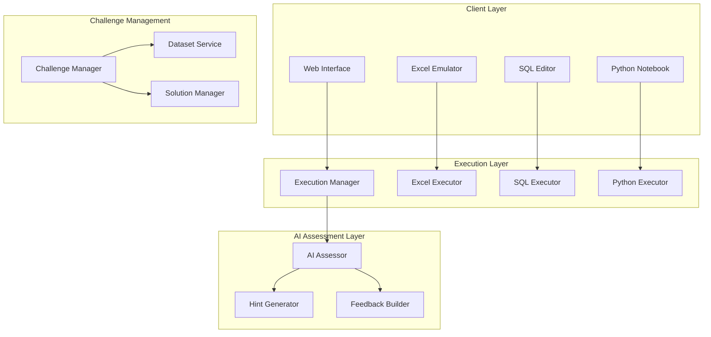

# DataMentor AI: Revised MVP - Technical Challenge Focus

## Updated MVP Scope Definition

### Core MVP Goal
Enable aspiring data analysts to master essential technical skills (Excel, SQL, Python) through AI-guided problem-solving scenarios with realistic workplace contexts.

### MVP Focus Shift
**Original**: Stakeholder communication + technical decision-making  
**Revised**: Technical problem-solving + practical application skills

### MVP Constraints (Updated)
- **Role focus**: Entry-level Data Analyst
- **3 technical scenarios**: Excel challenge, SQL problem, Python problem  
- **Individual learning**: No collaborative features
- **Web-based platform**: With integrated code/formula execution
- **AI mentorship**: Technical guidance and code review

---

## Redesigned Core Scenarios

### Scenario 1: Excel Data Analysis Challenge
**Learning Objective**: Master Excel functions, pivot tables, and data visualization for business analysis

#### **Scenario Context**: 
*"You're a new data analyst at RetailMax, an e-commerce company. Your manager Sarah needs a quick analysis of last quarter's sales performance before the board meeting tomorrow morning. She's given you a messy Excel file with 6 months of transaction data and asked you to create insights about product performance, seasonal trends, and customer segments."*

#### **Problem Setup**:
- **Dataset**: 10,000 rows of e-commerce transaction data (messy, with missing values, duplicates)
- **AI Agents**: 
  - **Excel Mentor Agent** (Sarah Chen - Data Analyst Manager)
  - **Business Context Agent** (Marketing Manager asking for specific insights)

#### **Challenge Components**:

**Phase 1: Data Cleaning (15 minutes)**
- Identify and handle missing values in customer demographics
- Remove duplicate transactions
- Standardize product categories and date formats
- Create calculated columns for revenue, profit margin, etc.

**Phase 2: Analysis & Insights (20 minutes)**
- Create pivot tables for sales by product category and month
- Calculate key metrics: average order value, customer lifetime value
- Identify top-performing products and customers
- Analyze seasonal trends and patterns

**Phase 3: Visualization & Presentation (10 minutes)**
- Create professional charts and graphs
- Build an executive dashboard
- Prepare 3 key insights with supporting data

#### **AI Mentorship Approach**:
```yaml
Excel_Mentor_Behavior:
  - Guides through Excel best practices step-by-step
  - Suggests efficient formulas and shortcuts
  - Reviews work and provides optimization tips
  - Asks probing questions: "What story does this data tell?"
  - Provides hints when student is stuck

Business_Context_Agent:
  - Plays role of stakeholder requesting analysis  
  - Asks clarifying questions about findings
  - Challenges assumptions and interpretations
  - Provides business context for data patterns
```

#### **Success Criteria**:
- Correctly clean data (90%+ accuracy in identifying issues)
- Create accurate pivot tables and calculations
- Generate meaningful business insights
- Present findings clearly and professionally

---

### Scenario 2: SQL Database Query Challenge  
**Learning Objective**: Write efficient SQL queries to extract insights from relational databases

#### **Scenario Context**:
*"TechStart's user engagement has been declining, and the product team needs to understand user behavior patterns. As the data analyst, you need to query the user activity database to identify which features are most engaging, when users typically churn, and what characteristics define high-value users."*

#### **Problem Setup**:
- **Database**: Multi-table schema (users, events, subscriptions, features)
- **AI Agents**:
  - **SQL Mentor Agent** (Marcus Rodriguez - Senior Data Engineer)  
  - **Product Manager Agent** (Alex Kim - asking for specific metrics)

#### **Database Schema**:
```sql
-- Tables provided in the challenge
users (user_id, signup_date, plan_type, company_size, industry)
events (event_id, user_id, event_type, feature_used, timestamp)
subscriptions (user_id, plan_type, start_date, end_date, mrr)
features (feature_id, feature_name, category, release_date)
```

#### **Challenge Components**:

**Phase 1: Data Exploration (10 minutes)**
- Understand table relationships and data structure
- Write queries to explore data quality and coverage
- Identify key metrics and dimensions available

**Phase 2: User Behavior Analysis (25 minutes)**
- Calculate daily/weekly active users
- Identify most and least used features
- Analyze user engagement patterns over time  
- Segment users by activity level and value

**Phase 3: Churn and Retention Analysis (10 minutes)**
- Define and calculate churn rate
- Identify characteristics of churning vs. retained users
- Find correlation between feature usage and retention

#### **AI Mentorship Approach**:
```yaml
SQL_Mentor_Behavior:
  - Reviews query structure and efficiency
  - Suggests optimizations and best practices
  - Explains complex JOIN operations and window functions
  - Helps debug syntax errors and logical issues
  - Provides alternative approaches to same problem

Product_Manager_Agent:
  - Requests specific business metrics
  - Asks follow-up questions about findings
  - Challenges data interpretations
  - Provides context about product changes and external factors
```

#### **Success Criteria**:
- Write syntactically correct and efficient SQL queries
- Properly join multiple tables and handle NULL values
- Calculate accurate business metrics
- Identify actionable insights about user behavior

---

### Scenario 3: Python Data Analysis Challenge
**Learning Objective**: Use Python (pandas, matplotlib) to clean, analyze, and visualize data

#### **Scenario Context**:
*"FinanceFirst Bank wants to improve their loan approval process. They've provided you with historical loan application data and asked you to build a predictive model to identify factors that influence loan defaults. Your analysis will inform their risk assessment criteria."*

#### **Problem Setup**:
- **Dataset**: 5,000 loan applications with 20+ features
- **Environment**: Jupyter notebook-style interface
- **AI Agents**:
  - **Python Mentor Agent** (Dr. Priya Patel - Senior Data Scientist)
  - **Risk Manager Agent** (Banking domain expert)

#### **Challenge Components**:

**Phase 1: Data Exploration & Cleaning (15 minutes)**
- Load data using pandas and explore structure
- Handle missing values and outliers
- Create new features (debt-to-income ratio, employment length bins)
- Perform basic statistical analysis

**Phase 2: Exploratory Data Analysis (20 minutes)**
- Create visualizations showing loan default patterns
- Analyze correlations between variables
- Identify key risk factors and trends
- Generate statistical summaries by loan segments

**Phase 3: Insights & Recommendations (10 minutes)**  
- Build simple classification model (logistic regression)
- Interpret model coefficients and feature importance
- Provide recommendations for loan approval criteria
- Create executive summary with key findings

#### **AI Mentorship Approach**:
```yaml
Python_Mentor_Behavior:
  - Guides through pandas operations and data manipulation
  - Suggests appropriate visualization types
  - Reviews code for efficiency and pythonic practices  
  - Helps debug errors and optimize performance
  - Explains statistical concepts and interpretation

Risk_Manager_Agent:
  - Provides banking domain expertise
  - Questions assumptions about risk factors
  - Requests specific regulatory compliance checks
  - Challenges model interpretations from business perspective
```

#### **Success Criteria**:
- Write clean, efficient Python code
- Properly handle data quality issues
- Create meaningful visualizations
- Build and interpret a basic predictive model
- Provide actionable business recommendations

---

## Updated Technical Architecture

### Core Technical Requirements

#### **1. Multi-Environment Execution Engine**
```typescript
interface ExecutionEnvironment {
  excel: ExcelExecutor;
  sql: SQLExecutor; 
  python: PythonExecutor;
}

class ExcelExecutor {
  async validateFormulas(formulas: string[]): Promise<ValidationResult>;
  async executeSolution(workbook: ExcelWorkbook): Promise<ExecutionResult>;
  async compareOutput(expected: any, actual: any): Promise<ComparisonResult>;
}

class SQLExecutor {
  async validateQuery(query: string): Promise<QueryValidation>;
  async executeQuery(query: string, database: string): Promise<QueryResult>;
  async checkPerformance(query: string): Promise<PerformanceMetrics>;
}

class PythonExecutor {
  async validateCode(code: string): Promise<CodeValidation>;
  async executeNotebook(cells: NotebookCell[]): Promise<NotebookResult>;
  async checkCodeQuality(code: string): Promise<QualityMetrics>;
}
```

#### **2. Challenge Management System**
```typescript
interface Challenge {
  id: string;
  type: 'excel' | 'sql' | 'python';
  title: string;
  description: string;
  context: BusinessContext;
  datasets: Dataset[];
  expectedSolutions: Solution[];
  evaluationCriteria: EvaluationCriteria;
  timeLimit: number;
}

interface Solution {
  type: SolutionType;
  content: string; // Formula, SQL query, or Python code
  explanation: string;
  alternativeApproaches: string[];
}
```

#### **3. Real-time Code Assessment**
```typescript
interface CodeAssessmentService {
  assessSolution(
    userSolution: UserSubmission,
    challenge: Challenge
  ): Promise<AssessmentResult>;
  
  provideHints(
    userAttempt: UserAttempt,
    challenge: Challenge
  ): Promise<Hint[]>;
  
  generateFeedback(
    assessment: AssessmentResult,
    learningHistory: LearningHistory
  ): Promise<PersonalizedFeedback>;
}

interface AssessmentResult {
  correctness: number; // 0-100
  efficiency: number; // 0-100
  bestPractices: number; // 0-100
  completeness: number; // 0-100
  detailedFeedback: FeedbackItem[];
  suggestedImprovements: string[];
}
```

### Updated System Architecture



---

## Updated User Stories & Acceptance Criteria

### Epic 1: Technical Challenge Execution

#### **User Story 1: Excel Challenge Interface**
```
As a data analyst learner, I want to work with Excel in a realistic environment 
so I can practice data analysis skills with immediate feedback.

Acceptance Criteria:
- User can upload/access provided Excel datasets
- Interface supports formulas, pivot tables, and chart creation
- Real-time validation of formulas and functions
- AI mentor provides contextual hints and suggestions
- Solution is automatically evaluated for correctness and efficiency
```

#### **User Story 2: SQL Query Editor**
```
As a learner, I want to write and test SQL queries against a real database 
so I can practice data extraction and analysis skills.

Acceptance Criteria:
- Web-based SQL editor with syntax highlighting
- Access to realistic multi-table database schema
- Query execution with result display
- Performance metrics and optimization suggestions
- AI mentor explains query logic and suggests improvements
```

#### **User Story 3: Python Analysis Environment**  
```
As a learner, I want to write Python code in a notebook environment 
so I can practice data science workflows end-to-end.

Acceptance Criteria:
- Jupyter-style notebook interface
- Pre-loaded datasets and common libraries (pandas, matplotlib, sklearn)
- Code execution with output display including plots
- Automated code quality and logic assessment  
- AI mentor guides through debugging and optimization
```

### Epic 2: AI-Powered Technical Mentorship

#### **User Story 4: Contextual Code Review**
```
As a learner, I want my code/formulas reviewed by an AI mentor 
so I can understand best practices and improve my technical skills.

Acceptance Criteria:
- AI analyzes code for correctness, efficiency, and style
- Provides specific, actionable improvement suggestions
- Explains reasoning behind recommendations
- Offers alternative approaches to solve the same problem
- Adapts feedback based on user's skill level
```

#### **User Story 5: Progressive Hint System**
```
As a learner, I want to receive helpful hints when I'm stuck 
so I can continue learning without getting frustrated.

Acceptance Criteria:
- Hint system activates when user is inactive for >2 minutes
- Provides progressively detailed hints (general → specific → solution)
- Maintains learning challenge without giving away answers
- Tracks hint usage to adjust difficulty for future challenges
- AI mentor explains concepts behind hints
```

### Epic 3: Progress Assessment & Learning Path

#### **User Story 6: Skill Assessment Dashboard**
```
As a learner, I want to see my technical skill progress across Excel, SQL, and Python 
so I can focus on areas that need improvement.

Acceptance Criteria:
- Visual dashboard showing competency levels in each tool
- Detailed breakdown of specific skills (formulas, joins, data visualization)
- Progress tracking over time with trend analysis
- Comparison with peer benchmarks and industry standards
- Personalized recommendations for next challenges
```

---

## Updated Success Metrics

### Technical Skill Metrics
```yaml
Code_Quality_Assessment:
  Excel_Proficiency:
    - Formula accuracy: >90%
    - Pivot table creation: >85% correct structure
    - Data visualization: >80% appropriate chart selection
    
  SQL_Proficiency:  
    - Query correctness: >90%
    - Join efficiency: >75% optimal query plans
    - Result accuracy: >95% correct data extraction
    
  Python_Proficiency:
    - Code execution success: >90%
    - Pandas operations: >85% efficient data manipulation
    - Visualization quality: >80% appropriate chart types

Skill_Progression:
  - 30% improvement in challenge completion time
  - 25% reduction in hints required per challenge
  - 40% improvement in code quality scores
```

### Learning Effectiveness Metrics  
```yaml
Challenge_Completion:
  - 80% completion rate for started challenges
  - 15 minute average completion time per challenge
  - 70% of learners complete all 3 challenge types

Knowledge_Application:
  - 85% can explain their solution approach
  - 75% can identify alternative solutions
  - 60% successfully apply learned concepts to new problems
```

### User Engagement Metrics
```yaml
Platform_Usage:
  - 3+ challenges attempted per session
  - 60% return rate within 7 days
  - 45 minute average session duration

AI_Interaction_Quality:
  - 90% of AI suggestions rated as helpful
  - 4.5+ star rating for AI mentor experience
  - <5% requests for human support
```

---

## Updated Implementation Roadmap

### Phase 1: Excel Challenge MVP (Weeks 1-4)
**Deliverable**: Fully functional Excel challenge with AI mentorship

**Week 1-2: Foundation**
- Set up Excel file processing and validation
- Implement basic formula checking
- Create Excel Mentor AI agent

**Week 3-4: Full Excel Scenario**
- Build complete e-commerce analysis challenge
- Implement business context AI agent
- Add progress tracking and feedback system

### Phase 2: SQL Challenge Addition (Weeks 5-8)
**Deliverable**: SQL query challenge with database execution

**Week 5-6: SQL Infrastructure**
- Set up sandboxed database environment
- Implement SQL query executor and validator
- Create SQL Mentor AI agent

**Week 7-8: Full SQL Scenario**
- Build user behavior analysis challenge
- Implement product manager AI agent
- Integrate with existing progress tracking

### Phase 3: Python Challenge Integration (Weeks 9-12)
**Deliverable**: Python notebook environment with full assessment

**Week 9-10: Python Environment**
- Set up secure Python code execution
- Implement notebook-style interface
- Create Python Mentor AI agent

**Week 11-12: Full Python Scenario**
- Build loan risk analysis challenge
- Implement risk manager AI agent
- Complete integrated learning dashboard

### Phase 4: Polish & Beta Launch (Weeks 13-16)
**Deliverable**: Production-ready MVP with 50 beta users

**Week 13-14: Integration & Testing**
- End-to-end testing of all three challenges
- Performance optimization and bug fixes
- User interface polish and accessibility

**Week 15-16: Beta Launch**
- Onboard 50 beta users
- Collect feedback and usage analytics
- Iterate based on user behavior and feedback

---

This revised MVP is much more focused and measurable, targeting the core technical skills that data analysts need most. The three challenges provide a comprehensive assessment of practical abilities while the AI mentorship ensures personalized learning and skill development.
