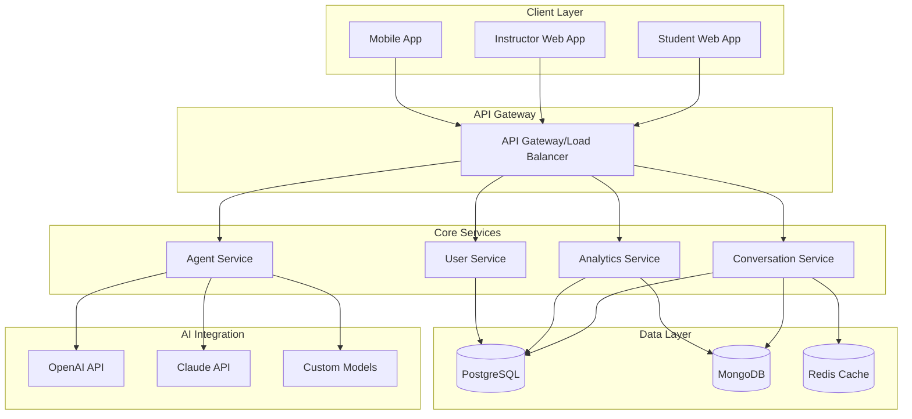
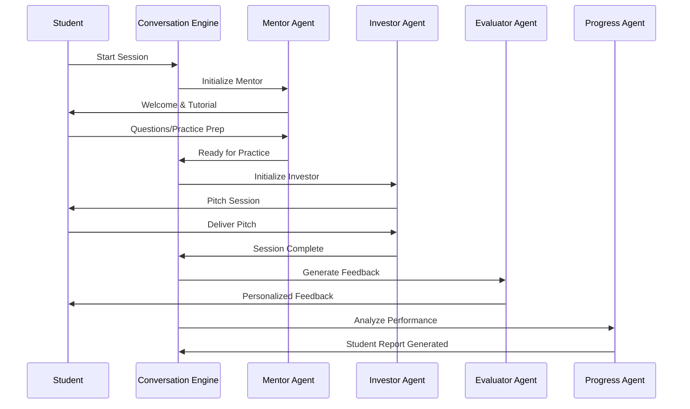
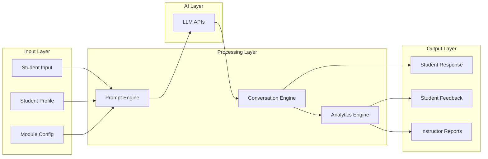

# Multi-Agent Educational Simulation System: Analysis & Specifications

## Table of Contents
1. [Design Thinking Analysis](#design-thinking-analysis)
2. [Systems Thinking Breakdown](#systems-thinking-breakdown)
3. [Computational Thinking Framework](#computational-thinking-framework)
4. [Technical Specifications](#technical-specifications)
5. [System Architecture](#system-architecture)
6. [Implementation Roadmap](#implementation-roadmap)

---

## Design Thinking Analysis

### 1. Empathize - Understanding User Needs

#### Primary Users & Pain Points

**Students:**
- **Pain Point**: Limited opportunities to practice skills in realistic, low-stakes environments
- **Need**: Safe space to make mistakes and learn from them
- **Pain Point**: Generic, one-size-fits-all educational content
- **Need**: Personalized learning experiences that adapt to their knowledge level
- **Pain Point**: Lack of immediate, constructive feedback
- **Need**: Real-time guidance and post-activity evaluation

**Educators/Instructors:**
- **Pain Point**: Expensive and time-consuming simulation development
- **Need**: Cost-effective tools to create engaging learning experiences
- **Pain Point**: Difficulty tracking individual student progress at scale
- **Need**: Detailed analytics on student performance and learning gaps
- **Pain Point**: Limited ability to customize content for different classes
- **Need**: Flexible, adaptable educational tools

**Educational Institutions:**
- **Pain Point**: High costs of traditional simulation platforms
- **Need**: Scalable solutions that can serve many students simultaneously
- **Pain Point**: Difficulty integrating new technologies into existing curricula
- **Need**: Easy-to-deploy solutions with clear educational outcomes

### 2. Define - Problem Statement

**Core Problem**: 
"Educational institutions and educators need an affordable, scalable way to provide personalized, interactive skill-practice opportunities that can adapt to individual student needs while providing instructors with actionable insights into student progress."

### 3. Ideate - Solution Concepts

**Key Solution Components:**
- Multi-agent AI system with specialized roles
- Conversational interfaces for natural interaction
- Real-time adaptation based on student responses
- Comprehensive analytics and reporting
- Modular design for different subject areas

### 4. Prototype Considerations

**MVP Features:**
- Single subject area (pitching) as proof of concept
- Core agent types (Mentor, NPC, Evaluator)
- Basic conversation management
- Simple reporting dashboard

### 5. Test - Validation Approach

**Testing Strategy:**
- A/B testing against traditional methods
- User experience feedback collection
- Learning outcome measurement
- System performance monitoring

---

## Systems Thinking Breakdown

### System Boundaries and Environment

#### Internal System Components:
1. **AI Agent Network** - Core processing units
2. **Conversation Management** - Flow control and state management
3. **Content Repository** - Educational materials and prompts
4. **Analytics Engine** - Data collection and analysis
5. **User Interface** - Student and instructor interactions

#### External Environment:
1. **AI/LLM Services** (OpenAI, Claude, etc.)
2. **Educational Management Systems** (Canvas, Blackboard)
3. **Authentication Services**
4. **Cloud Infrastructure**
5. **Database Systems**

### Stakeholder Relationships

```
Students ←→ AI Agents ←→ Conversation Engine ←→ Analytics Engine ←→ Instructors
    ↓              ↓                ↓                  ↓           ↓
Learning        Content         State            Insights     Curriculum
Outcomes       Repository      Management       Dashboard     Planning
```

### System Dynamics and Feedback Loops

#### Positive Feedback Loops:
- Better AI responses → Improved student engagement → More practice → Better learning outcomes
- More usage data → Better analytics → Improved instruction → Better student outcomes

#### Negative Feedback Loops (Controls):
- Poor AI response → Student disengagement → Lower completion rates → System alerts
- Excessive AI costs → Usage limits → Reduced access → Need for optimization

### Emergent Properties:
- Personalized learning pathways that emerge from agent interactions
- Collective intelligence from aggregated student data
- Adaptive curriculum that evolves based on class performance

---

## Computational Thinking Framework

### 1. Decomposition - Breaking Down Complex Problems

#### Level 1: System Components
```
Educational Simulation System
├── Agent Management System
├── Conversation Processing Engine
├── Content Management System
├── Analytics and Reporting System
└── User Interface System
```

#### Level 2: Agent Management System
```
Agent Management System
├── Agent Factory (creates agent instances)
├── Agent Coordinator (manages inter-agent communication)
├── Agent State Manager (tracks conversation states)
└── Agent Configuration (manages prompts and behaviors)
```

#### Level 3: Individual Agent Logic
```
Individual Agent
├── Prompt Construction
├── Context Management
├── Response Generation
├── State Transition Logic
└── Error Handling
```

### 2. Pattern Recognition - Identifying Common Structures

#### Agent Interaction Patterns:
1. **Sequential Pattern**: Mentor → Practice → Evaluation
2. **Parallel Pattern**: Multiple agents processing student data simultaneously
3. **Hierarchical Pattern**: Individual assessments → Class insights
4. **Feedback Pattern**: Student input → Agent processing → Response → State update

#### Conversation Flow Patterns:
1. **Linear Flow**: Structured progression through learning phases
2. **Branching Flow**: Different paths based on student responses
3. **Loop Pattern**: Practice until competency achieved
4. **Exception Handling**: Recovery from unexpected inputs

### 3. Abstraction - Simplifying Complex Systems

#### Core Abstractions:

**Agent Interface:**
```typescript
interface Agent {
  id: string;
  type: AgentType;
  processInput(input: StudentInput): Promise<AgentResponse>;
  updateState(context: ConversationContext): void;
  getStatus(): AgentStatus;
}
```

**Conversation Context:**
```typescript
interface ConversationContext {
  studentId: string;
  sessionId: string;
  currentPhase: LearningPhase;
  history: ConversationTurn[];
  studentProfile: StudentProfile;
}
```

**Learning Module:**
```typescript
interface LearningModule {
  id: string;
  title: string;
  agents: Agent[];
  learningObjectives: string[];
  assessmentCriteria: AssessmentCriteria[];
}
```

### 4. Algorithm Design - Step-by-Step Solutions

#### Core Algorithms:

**1. Conversation Management Algorithm:**
```
BEGIN ConversationManager
  INITIALIZE student_context
  WHILE session_active DO
    RECEIVE student_input
    DETERMINE current_agent = GetActiveAgent(context)
    SEND input TO current_agent
    RECEIVE response FROM current_agent
    UPDATE conversation_context
    SEND response TO student
    CHECK transition_conditions
    IF phase_complete THEN
      TRANSITION to next_phase
    END IF
  END WHILE
END
```

**2. Agent Selection Algorithm:**
```
BEGIN AgentSelection
  INPUT: conversation_context, available_agents
  
  EVALUATE context.current_phase
  CASE phase OF
    TUTORIAL: RETURN mentor_agent
    PRACTICE: RETURN npc_agent
    EVALUATION: RETURN evaluator_agent
    DEFAULT: RETURN default_agent
  END CASE
END
```

**3. Adaptive Response Algorithm:**
```
BEGIN AdaptiveResponse
  INPUT: student_input, student_profile, conversation_history
  
  ANALYZE student_competency_level
  ADJUST response_complexity
  SELECT appropriate_examples
  CUSTOMIZE feedback_style
  GENERATE personalized_response
  
  RETURN adapted_response
END
```

---

## Technical Specifications

### 1. Core Architecture Components

#### 1.1 Agent Management Service
```typescript
class AgentManager {
  private agents: Map<string, Agent> = new Map();
  private agentFactory: AgentFactory;
  
  async createAgent(config: AgentConfig): Promise<Agent> {
    // Agent creation logic
  }
  
  async routeMessage(sessionId: string, message: Message): Promise<Response> {
    // Message routing logic
  }
  
  async manageSession(sessionId: string): Promise<SessionState> {
    // Session management logic
  }
}
```

#### 1.2 Conversation Engine
```typescript
interface ConversationEngine {
  startSession(studentId: string, moduleId: string): Promise<SessionContext>;
  processInput(sessionId: string, input: StudentInput): Promise<AgentResponse>;
  manageStateTransition(sessionId: string): Promise<TransitionResult>;
  endSession(sessionId: string): Promise<SessionSummary>;
}
```

#### 1.3 Analytics Service
```typescript
interface AnalyticsService {
  trackInteraction(sessionId: string, interaction: Interaction): Promise<void>;
  generateStudentReport(studentId: string): Promise<StudentReport>;
  generateClassInsights(classId: string): Promise<ClassInsights>;
  exportData(criteria: ExportCriteria): Promise<ExportResult>;
}
```

### 2. Data Models

#### 2.1 Core Entities
```typescript
interface Student {
  id: string;
  name: string;
  email: string;
  profile: StudentProfile;
  enrollments: Enrollment[];
}

interface StudentProfile {
  learningStyle: LearningStyle;
  interests: string[];
  skillLevel: SkillLevel;
  previousExperience: string;
}

interface Session {
  id: string;
  studentId: string;
  moduleId: string;
  startTime: Date;
  endTime?: Date;
  status: SessionStatus;
  context: ConversationContext;
}

interface Interaction {
  id: string;
  sessionId: string;
  agentType: AgentType;
  studentInput: string;
  agentResponse: string;
  timestamp: Date;
  metadata: InteractionMetadata;
}
```

#### 2.2 Agent Configuration
```typescript
interface AgentConfig {
  type: AgentType;
  systemPrompt: string;
  behaviorParams: BehaviorParameters;
  constraints: AgentConstraints;
  maxIterations: number;
  contextWindow: number;
}

interface BehaviorParameters {
  personality: PersonalityTraits;
  responseStyle: ResponseStyle;
  adaptationLevel: AdaptationLevel;
  supportLevel: SupportLevel;
}
```

### 3. API Specifications

#### 3.1 Student Interface APIs
```typescript
// Start new learning session
POST /api/sessions
{
  studentId: string;
  moduleId: string;
  preferences?: SessionPreferences;
}

// Send message to current agent
POST /api/sessions/{sessionId}/messages
{
  message: string;
  messageType: MessageType;
}

// Get session status
GET /api/sessions/{sessionId}/status

// End session
POST /api/sessions/{sessionId}/complete
```

#### 3.2 Instructor Interface APIs
```typescript
// Get student progress
GET /api/students/{studentId}/progress

// Get class insights
GET /api/classes/{classId}/insights

// Configure learning module
PUT /api/modules/{moduleId}/config
{
  agents: AgentConfig[];
  learningObjectives: string[];
  assessmentCriteria: AssessmentCriteria[];
}

// Export analytics data
POST /api/analytics/export
{
  criteria: ExportCriteria;
  format: ExportFormat;
}
```

### 4. Infrastructure Requirements

#### 4.1 Technology Stack
- **Backend**: Node.js/TypeScript or Python/FastAPI
- **Database**: PostgreSQL (structured data) + MongoDB (conversations)
- **AI/LLM Integration**: OpenAI API, Anthropic Claude API
- **Real-time Communication**: WebSocket or Server-Sent Events
- **Authentication**: OAuth 2.0 / SAML integration
- **Monitoring**: Prometheus + Grafana
- **Deployment**: Docker + Kubernetes

#### 4.2 Scalability Considerations
- **Horizontal Scaling**: Microservices architecture
- **Caching**: Redis for session state and frequent queries
- **Load Balancing**: nginx or cloud load balancer
- **CDN**: Static content delivery
- **Database Sharding**: Student data partitioning

#### 4.3 Security Requirements
- **Data Encryption**: AES-256 at rest, TLS 1.3 in transit
- **Authentication**: Multi-factor authentication
- **Authorization**: Role-based access control (RBAC)
- **Privacy**: GDPR/FERPA compliance
- **Audit Logging**: Comprehensive activity logs
- **Rate Limiting**: API request throttling

---

## System Architecture

### 1. High-Level Architecture Diagram



### 2. Agent Interaction Flow



### 3. Data Flow Architecture



### 4. Component Responsibilities

#### 4.1 Frontend Components
- **Student Interface**: Interactive chat interface, progress tracking, feedback display
- **Instructor Dashboard**: Analytics visualization, class management, configuration tools
- **Admin Panel**: System monitoring, user management, content management

#### 4.2 Backend Services
- **Agent Service**: Manages AI agent lifecycle and interactions
- **Conversation Service**: Handles session management and message routing
- **Analytics Service**: Processes and analyzes interaction data
- **User Service**: Manages authentication and user profiles
- **Content Service**: Manages educational content and configurations

#### 4.3 Data Management
- **Operational Data**: User profiles, session states, configurations
- **Analytical Data**: Interaction logs, performance metrics, insights
- **Content Data**: Prompts, learning materials, assessment criteria

---

## Implementation Roadmap

### Phase 1: Foundation (Months 1-3)
**Objective**: Build core infrastructure and basic functionality

#### Sprint 1-2: Core Infrastructure
- Set up development environment and CI/CD pipeline
- Implement basic user authentication and authorization
- Create database schemas and initial data models
- Set up monitoring and logging infrastructure

#### Sprint 3-4: Basic Agent Framework
- Implement Agent interface and base classes
- Create simple conversation management system
- Build basic prompt construction and LLM integration
- Develop minimal web interface for testing

#### Sprint 5-6: Single Agent MVP
- Implement Mentor Agent with basic functionality
- Create simple conversation flow management
- Build basic analytics tracking
- Conduct initial testing and iteration

### Phase 2: Multi-Agent System (Months 4-6)
**Objective**: Implement full agent ecosystem

#### Sprint 7-8: Agent Expansion
- Implement Investor Agent (NPC) with persona management
- Create Evaluator Agent with feedback generation
- Build agent coordination and handoff mechanisms
- Implement conversation state management

#### Sprint 9-10: Advanced Features
- Add Progress Agent and Class Insights Agent
- Implement adaptive response generation
- Build comprehensive analytics dashboard
- Create instructor interface and reporting tools

#### Sprint 11-12: Integration and Testing
- Integrate all agents into cohesive system
- Implement comprehensive testing framework
- Conduct user acceptance testing
- Performance optimization and bug fixes

### Phase 3: Enhancement and Scale (Months 7-9)
**Objective**: Optimize performance and add advanced features

#### Sprint 13-14: Performance Optimization
- Implement caching and optimization strategies
- Add horizontal scaling capabilities
- Optimize database queries and data models
- Load testing and performance tuning

#### Sprint 15-16: Advanced Analytics
- Build sophisticated reporting and insights
- Implement predictive analytics features
- Add data export and integration capabilities
- Create automated testing and quality assurance

#### Sprint 17-18: Polish and Deploy
- UI/UX improvements and accessibility features
- Security auditing and compliance verification
- Documentation and training materials
- Production deployment and monitoring setup

### Phase 4: Extension and Maintenance (Months 10-12)
**Objective**: Expand capabilities and ensure sustainability

#### Sprint 19-20: Multi-Domain Support
- Abstract system for multiple subject areas
- Create template system for new learning modules
- Build content management and authoring tools
- Implement plugin architecture for extensions

#### Sprint 21-22: Advanced AI Features
- Experiment with fine-tuned models
- Implement advanced personalization algorithms
- Add multimodal capabilities (voice, video)
- Research and prototype next-generation features

#### Sprint 23-24: Community and Ecosystem
- Create developer APIs and documentation
- Build community features and sharing capabilities
- Implement marketplace for educational content
- Establish feedback loops and continuous improvement

### Success Metrics and KPIs

#### Technical Metrics:
- **Response Time**: < 2 seconds for 95% of agent responses
- **Uptime**: 99.9% system availability
- **Scalability**: Support 1000+ concurrent users
- **Accuracy**: 90%+ appropriate AI responses

#### Educational Metrics:
- **Engagement**: 80%+ session completion rate
- **Learning Outcomes**: 25% improvement over traditional methods
- **User Satisfaction**: 4.5+ star rating
- **Adoption**: 50+ educational institutions in first year

#### Business Metrics:
- **Cost Efficiency**: 60% reduction in simulation development costs
- **Time to Market**: 80% faster deployment than traditional simulations
- **Revenue**: Sustainable pricing model with positive unit economics
- **Growth**: 100% year-over-year user growth

---

This comprehensive analysis provides a structured approach to understanding and implementing the multi-agent educational simulation system, breaking down the complex problem into manageable components while maintaining a clear vision of the overall system goals and architecture.